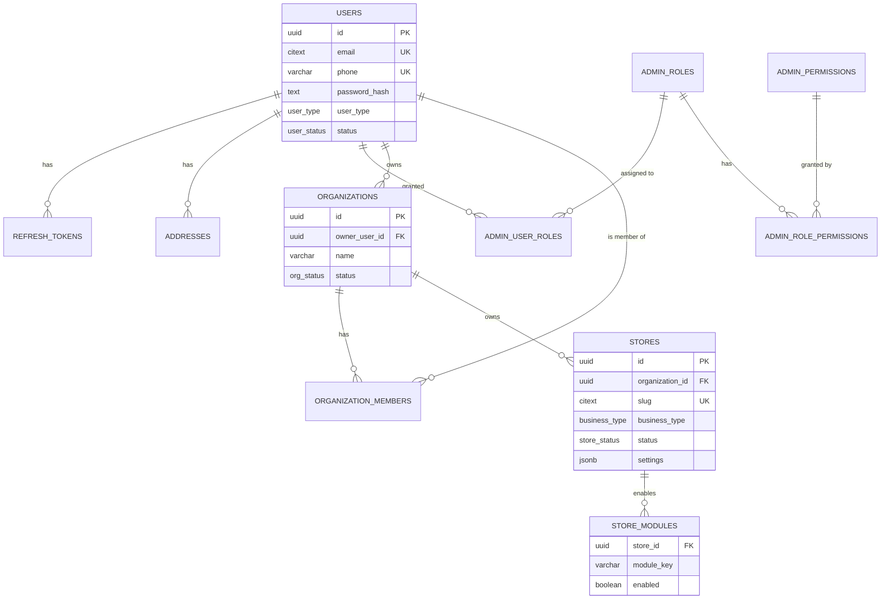
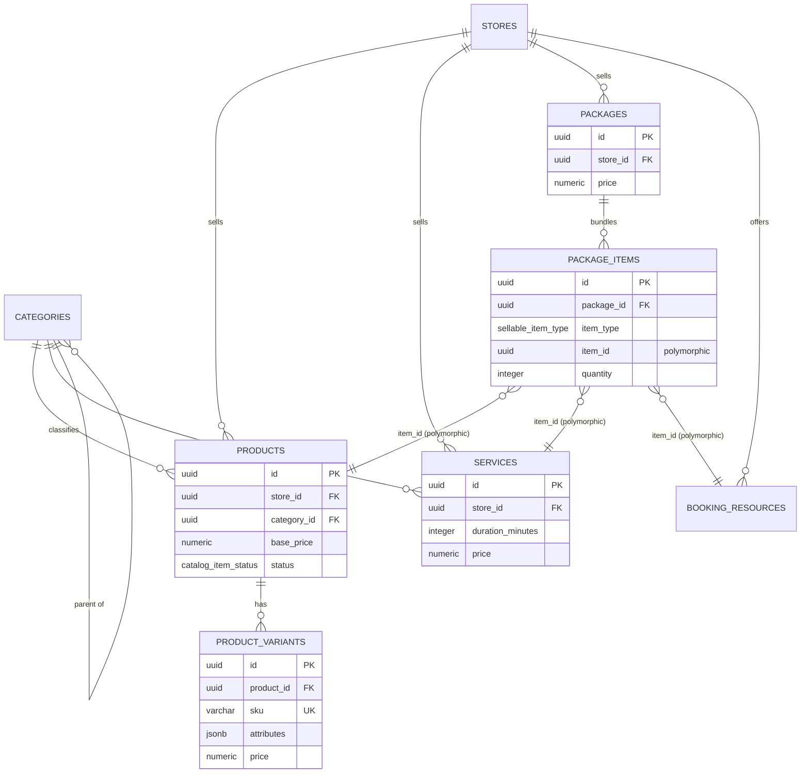
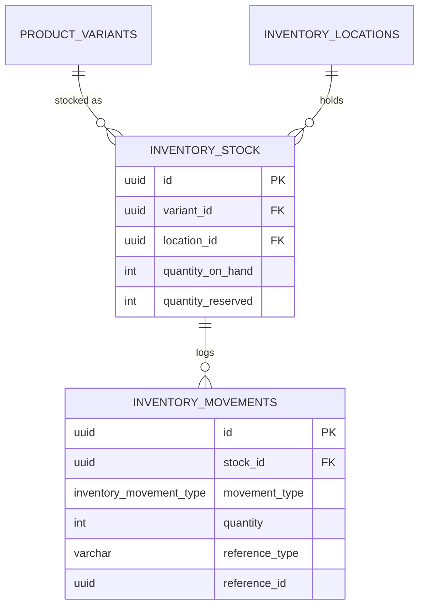
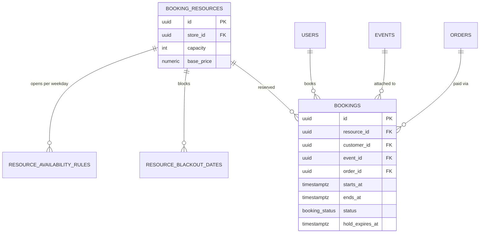
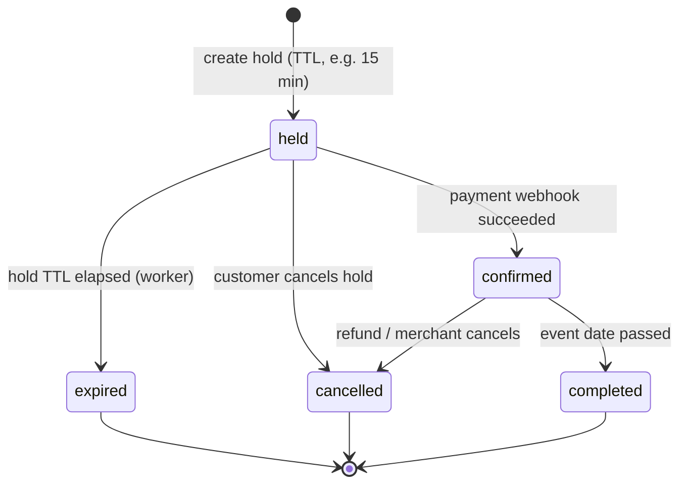
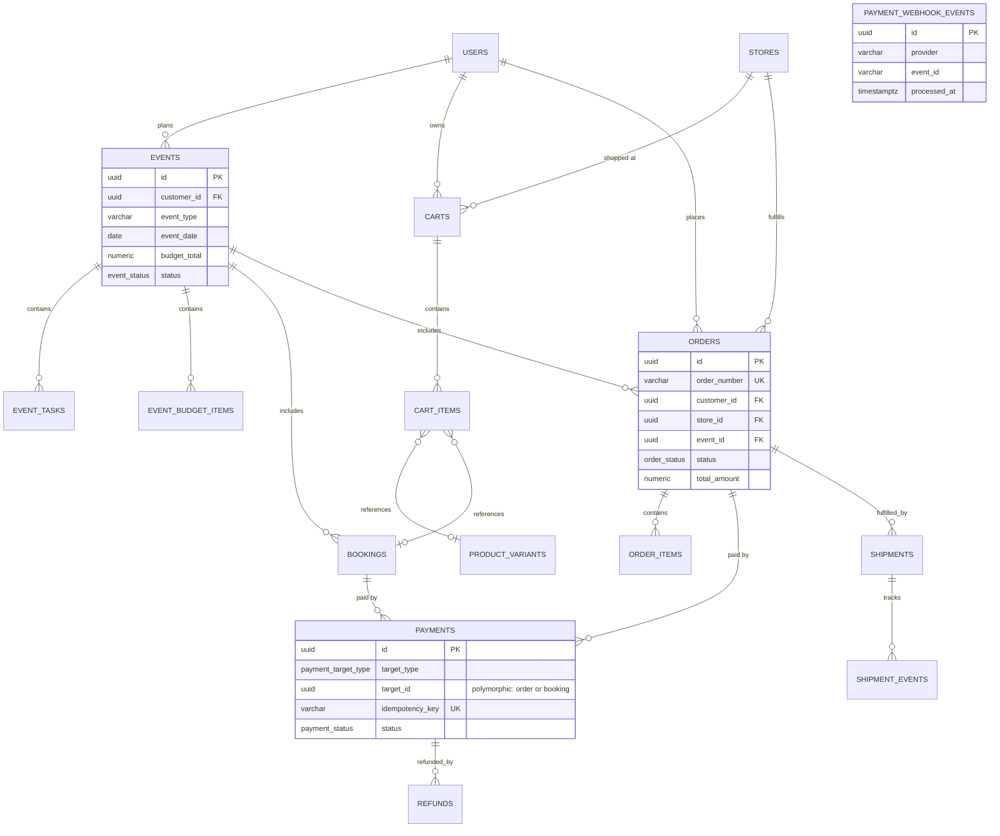
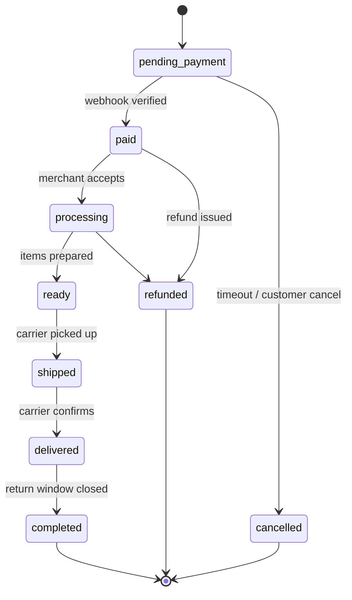
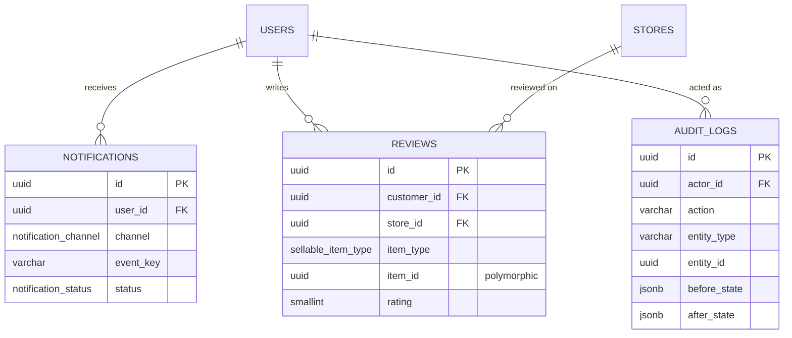
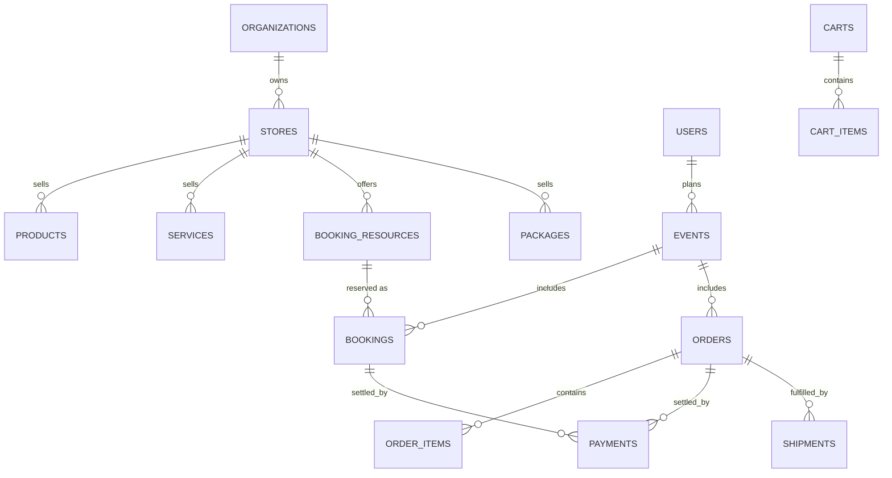

# Laylaty Platform — Entity Relationship Diagram (ERD)

This ERD mirrors [`schema.sql`](./schema.sql) exactly — every entity, field name,
and relationship below has a matching table in the SQL. The diagram is split into
six domain views (matching the backend modules) because a single 40-table
diagram is unreadable; a combined key-relationship map closes the section.

Conventions:
- `PK` primary key, `FK` foreign key, `UK` unique key
- All primary keys are `UUID` (`gen_random_uuid()`)
- All monetary columns are `NUMERIC(12,2)` with an explicit `currency`
- Polymorphic references (`item_type` + `item_id`) are drawn as dashed notes,
  not real FKs, since Postgres cannot enforce polymorphic FKs directly

---

## 1. Identity & Multi-Tenant Root

**Tenant isolation rule:** every row below the `STORES` line carries a
`store_id` (or reaches one transitively). The API layer derives `store_id` /
`organization_id` from the authenticated user's session — it is **never**
accepted as a client-supplied parameter (see blueprint, "MULTI-TENANT
ARCHITECTURE").

---

## 2. Catalog — Unified Commerce (Product / Service / Package)

`item_type` + `item_id` is the "Sellable Item" polymorphism described in the
blueprint's `UNIFIED COMMERCE ENGINE` — the same pattern recurs in
`cart_items`, `order_items`, and `reviews`.

---

## 3. Inventory

**Available stock formula (enforced by `CHECK`):**
`quantity_on_hand - quantity_reserved >= 0`. Adding an item to a cart issues a
`reserve` movement; payment success issues `confirm`; cart expiry/cancel
issues `release` (see blueprint, "INVENTORY ENGINE").

---

## 4. Booking Engine

**Double-booking prevention** is enforced at the database level with a
`PostgreSQL EXCLUDE USING gist` constraint on
`(resource_id, tstzrange(starts_at, ends_at))` for `status IN ('held',
'confirmed')` — this is the physical implementation of the blueprint's
"منع الحجز المزدوج" rule; it is a hard guarantee, not just an
application-level `is_available?` check.

**Booking state machine:**

---

## 5. Events, Commerce & Payments

**Payment idempotency** is enforced by `UNIQUE (provider, event_id)` on
`payment_webhook_events` (a duplicate provider webhook delivery is a no-op)
and by `payments.idempotency_key UNIQUE` on the create-payment side — the
direct implementation of the blueprint's "كل عملية دفع يجب أن تكون
Idempotent" rule.

**Order state machine:**

---

## 6. Notifications, Reviews & Audit

---

## 7. Cross-Domain Key Map (condensed)

This is the visual proof of the blueprint's central claim: **`EVENTS`, not
`STORES`, sits at the top of the customer-facing graph** — an event fans out
into bookings and orders across many different stores, which is the
structural difference from a single-store commerce platform (Salla/Zid model).
